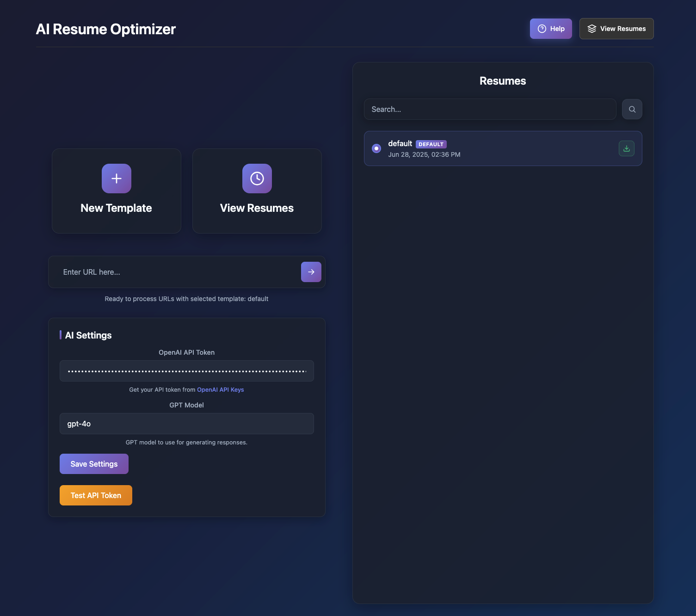

# AI Resume Optimizer

## 🖼️ Screenshot



## 🚀 Features

- **AI-Powered Optimization**: Uses OpenAI GPT models to analyze job postings and optimize resume templates
- **Smart Web Crawling**: Automatically crawls job posting URLs to extract relevant content
- **Template Management**: Create, edit, and manage multiple resume templates
- **Keyword Extraction**: AI identifies and incorporates relevant keywords from job postings
- **Duplicate Detection**: Prevents processing the same URL multiple times
- **Streaming Responses**: Handles large AI responses efficiently with streaming
- **Modern UI**: Clean, dark-themed interface with responsive design
- **Template Preview**: Preview resume templates before downloading
- **PDF Export**: Download optimized resumes as PDF files

## 🛠️ Tech Stack

- **Frontend**: Next.js 14, React, CSS Modules
- **Backend**: Next.js API Routes
- **AI**: OpenAI GPT-4o (configurable)
- **Styling**: Custom CSS with dark theme
- **File Handling**: Node.js file system operations

## 📋 Prerequisites

- Node.js 18+ 
- npm or yarn
- OpenAI API key

## 🔧 Installation

### Option 1: Traditional Installation

1. **Clone the repository**
   ```bash
   git clone <your-repo-url>
   cd ResumeApp/app
   ```

2. **Install dependencies**
   ```bash
   npm install
   ```

3. **Run the development server**
   ```bash
   npm run dev
   ```

4. **Open your browser**
   Navigate to [http://localhost:3000](http://localhost:3000)

### Option 2: Docker Installation

The project includes comprehensive Docker support for both development and production environments.

#### Quick Start with Docker

**Development Environment:**
```bash
# Start development environment with hot reloading
docker-compose --profile dev up
```

**Production Environment:**
```bash
# Start production environment
docker-compose --profile prod up
```

**Production with Nginx Reverse Proxy:**
```bash
# Start with nginx reverse proxy
docker-compose --profile nginx up
```

#### Manual Docker Commands

**Development:**
```bash
docker build -f Dockerfile.dev -t resume-app-dev .
docker run -p 3000:3000 -v $(pwd):/app resume-app-dev
```

**Production:**
```bash
docker build -t resume-app-prod .
docker run -p 3000:3000 resume-app-prod
```

For detailed Docker documentation, see [DOCKER.md](DOCKER.md).

---

**Note**: This application is designed for personal use. Always review AI-generated content before using it in professional applications. 

**Important Limitation**: The app is designed to work with publicly accessible job posting URLs. It is unlikely to work with job links that require authentication (e.g., LinkedIn, internal company portals, or any site behind a login). For best results, use job postings that are viewable without logging in.

## 🎯 Usage

### Getting Started

1. **Access the App**: Open the application in your browser
2. **View Help**: Click the "Help" button for detailed usage instructions
3. **Manage Templates**: Use "View Resumes" to create and manage templates

### Processing Job URLs

1. **Enter Job URL**: Paste a job posting URL in the input field
2. **Select Templates**: Choose which resume templates to optimize
3. **Process**: Click "Process URL" to start the optimization
4. **Review Results**: View and download the optimized templates

### Template Management

- **Create Templates**: Add new resume templates with custom content
- **Edit Templates**: Double-click template names to edit
- **Preview Templates**: Double-click templates to preview content
- **Download Templates**: Use the download button to save as PDF

## 📁 Project Structure

```
app/
├── app/
│   ├── api/                 # API routes
│   │   ├── crawl/          # URL crawling endpoint
│   │   ├── process-with-ai/ # AI processing endpoint
│   │   ├── settings/       # Settings management
│   │   └── ...            # Other API endpoints
│   ├── components/         # React components
│   ├── new-template/       # Template creation page
│   ├── usage/             # Help and usage page
│   └── page.js            # Main application page
├── data/                  # Data storage
│   ├── __resume_templates/ # Generated templates
│   ├── crawls/            # Crawled data
│   └── settings.json      # App settings
├── public/                # Static assets
└── temp/                  # Temporary files
```

## ⚙️ Configuration

### AI Model Settings

The app uses GPT-4o by default, but you can configure different models:

1. Go to Settings in the app
2. Select your preferred GPT model
3. Save the configuration

### API Endpoints

- `POST /api/crawl` - Crawl job posting URLs
- `POST /api/process-with-ai` - Process content with AI
- `GET /api/settings` - Get app settings
- `POST /api/settings` - Update app settings

## 🔒 Security

- API keys are stored securely in environment variables
- Input validation on all endpoints
- Rate limiting for API calls
- Secure file handling

## 🐛 Troubleshooting

### Common Issues

1. **Crawl Failures**: Some websites may block automated crawling
2. **Token Limits**: Large job postings may exceed AI token limits (handled automatically)
3. **File Permissions**: Ensure the app has write permissions to the `data` directory

## 🤝 Contributing

1. Fork the repository
2. Create a feature branch (`git checkout -b feature/amazing-feature`)
3. Commit your changes (`git commit -m 'Add amazing feature'`)
4. Push to the branch (`git push origin feature/amazing-feature`)
5. Open a Pull Request

## 📝 License

This project is licensed under the MIT License - see the [LICENSE](LICENSE) file for details.

## 🙏 Acknowledgments

- OpenAI for providing the GPT API
- Next.js team for the excellent framework
- The open-source community for various tools and libraries

## 📞 Support

If you encounter any issues or have questions:

1. Check the help section in the app
2. Review the troubleshooting guide above
3. Open an issue on GitHub
4. Check the usage documentation at `/usage`

---

**Note**: This application is designed for personal use. Always review AI-generated content before using it in professional applications.

